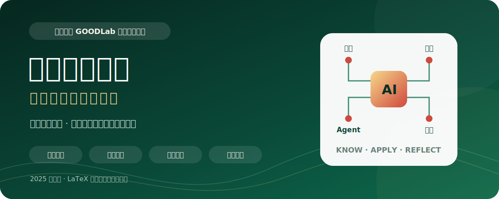
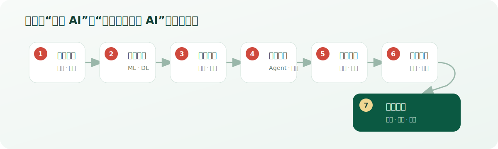

<p align="center">
  
</p>

<h1 align="center">《人工智能概论：应用驱动的人工智能》</h1>

<p align="center">
  南昌大学 <strong>GOODLab</strong> 相关团队出品 · 面向广泛读者的人工智能通识教材源稿与教学资源
</p>

<p align="center">
  <a href="https://item.taobao.com/item.htm?id=1067141988036">购买纸质书</a>
  · <a href="https://good.ncu.edu.cn/">GOODLab 官网</a>
  · <a href="https://szjc.ncu.edu.cn/">访问数字平台</a>
  · <a href="https://github.com/Nanqipro/Introduction-to-Artificial-Intelligence">数字平台代码</a>
  · <a href="https://github.com/Nanqipro/AI_Book_Revision_2026">第二版项目</a>
</p>

> **出版状态**：第一版已由机械工业出版社出版，出版日期为 **2025-07-15**，ISBN **978-7-111-78324-4**。本仓库保存的是编写过程中的 LaTeX 源稿、章节配图与教学素材，不是出版社正式电子书，内容和版式可能与纸质成书存在差异。

## 这本书讲什么

本书从计算与智能的基本问题出发，逐步介绍人工智能、机器学习、深度学习、计算机视觉、语音识别和生成式人工智能等核心概念；再通过智能助手、AI Agent、艺术、交通、医疗和农业等现实场景解释技术如何落地；最后以图像分类项目串联数据处理、模型训练与评估，并讨论算法歧视、隐私、责任和安全。

它适合希望建立完整 AI 认知框架的高校学生、跨专业学习者、教师与普通读者。读者可以按章节循序建立概念框架，第 6 章则提供进一步动手实践的入口。

## 内容特色

- **应用驱动**：从生活与行业问题切入，再解释背后的模型与方法。
- **由浅入深**：覆盖概念、基础、核心技术、场景应用、模型、项目和伦理七个层次。
- **知行结合**：第 6 章以 Python 图像分类为例，展示数据、训练、可视化和评估流程。
- **数字延伸**：配套平台把纸质教材延伸为可交互的在线学习体验。
- **责任意识**：把偏见、隐私、责任和监管纳入通识学习路径。

<p align="center">
  
</p>

## 章节导览

| 章节 | 主题 | 主要内容 | 源稿署名 |
| --- | --- | --- | --- |
| 第 1 章 | 初识人工智能 | 智能与人工智能的定义、分类、发展历史和现状 | 龚傲 |
| 第 2 章 | 人工智能基础 | 人工智能、机器学习、深度学习的关系，神经网络与训练方法 | 吴琳鑫 |
| 第 3 章 | 人工智能核心技术 | 计算机视觉、语音识别、生成式人工智能 | 易炜涵 |
| 第 4 章 | 不同领域的应用 | 智能助手、AI Agent、艺术、交通、医疗和农业 | 赵劲、徐微 |
| 第 5 章 | 人工智能模型初探 | 线性回归、逻辑回归、模型配置与参数优化 | 周子祺 |
| 第 6 章 | 第一个人工智能项目 | Python、图像数据、模型构建、训练、混淆矩阵和评估报告 | 钟咏涛、郑浩男 |
| 第 7 章 | 人工智能的思考 | 算法歧视、数据隐私、责任与安全 | 程子乾 |

## 图书信息

<table>
  <tr>
    <td width="42%" align="center">
      
    </td>
    <td valign="top">
      <strong>书名</strong><br>
      《人工智能概论：应用驱动的人工智能》<br><br>
      <strong>编著</strong><br>
      徐子晨、曾勋炜、杜建强<br><br>
      <strong>团队</strong><br>
      南昌大学 GOODLab 相关团队<br><br>
      <strong>出版社</strong><br>
      机械工业出版社<br><br>
      <strong>出版日期</strong><br>
      2025-07-15<br><br>
      <strong>ISBN</strong><br>
      978-7-111-78324-4
    </td>
  </tr>
</table>

> 展示图为新书宣传海报的公开安全裁切版；仅移除了二维码区域，书名、作者、日期及 ISBN 均保持原图内容。

## 配套资源

### GOODLab

本书由南昌大学 [GOODLab（Generic Operational and Optimal Data Lab）](https://good.ncu.edu.cn/) 相关团队出品。实验室研究与团队信息以官方网站为准。

### 数字教材平台

[南昌大学数字教材平台](https://szjc.ncu.edu.cn/)提供本书对应的数字化学习内容。平台账号仅面向南昌大学及获得本书官方授权学校的师生开放，账号通常为对应学号；能否登录以学校实际授权为准。

平台的开发代码位于 [Nanqipro/Introduction-to-Artificial-Intelligence](https://github.com/Nanqipro/Introduction-to-Artificial-Intelligence)，与本仓库的 LaTeX 书稿分开维护。

### 第二版

[Nanqipro/AI_Book_Revision_2026](https://github.com/Nanqipro/AI_Book_Revision_2026)用于筹备第二版：**一本写给广泛读者的、关于当下 AI Agent 应用的通识教程。** 第二版尚未在本仓库发布，具体进度以对应仓库为准。

## 仓库结构

```text
AI_Book_Revision_2025/
├── book.tex                 # LaTeX 主入口
├── package.tex              # 宏包配置
├── title.tex                # 标题页
├── preface.tex              # 仓库版本说明
├── chapter_1.tex            # 第 1 章：初识人工智能
├── ...
├── chapter_7.tex            # 第 7 章：人工智能的思考
├── image/                   # 各章使用的图片与运行结果
├── docs/
│   ├── ASSET_NOTES.md       # 图片来源与公开发布注意事项
│   └── readme-assets/       # README 专用视觉资源
├── LICENSE
└── README.md
```

第 6 章的 Python 示例以内嵌 `lstlisting` 形式保存在 `chapter_6.tex` 中；本仓库当前不包含可独立运行的数据集、Notebook 或 Python 工程。交互式平台代码请前往配套开发仓库。

## 本地编译

### 环境

- TeX Live 2021 或更新版本；
- XeLaTeX；
- `ctex`、`algorithm2e`、`listings` 等 `package.tex` 中列出的宏包。

### 构建

```bash
git clone https://github.com/Nanqipro/AI_Book_Revision_2025.git
cd AI_Book_Revision_2025

xelatex -interaction=nonstopmode -halt-on-error book.tex
xelatex -interaction=nonstopmode -halt-on-error book.tex
```

如果本地安装了 `latexmk`，也可以运行：

```bash
latexmk -xelatex -interaction=nonstopmode -halt-on-error book.tex
```

在 Overleaf 中可上传仓库源码并把编译器设为 XeLaTeX。生成的 `book.pdf` 是本仓库源稿的本地构建产物，不是出版社正式电子版，因此默认不纳入版本控制。

> 当前整理环境未安装 XeLaTeX，以上命令已按源码依赖做静态检查，但尚未在本机完成重新编译验证。欢迎在具备 TeX Live 的环境中反馈可复现的构建问题。

## 参与完善

欢迎通过 Issue 或 Pull Request 提交：

- 错别字、排版与交叉引用修复；
- 有可靠来源支持的事实更新；
- 可复现的 LaTeX 构建改进；
- 无障碍描述、图片来源与授权信息补充；
- 与教材配套、且不包含受限数据的教学示例。

提交外部图片、数据、代码或长篇引用前，请确认再分发权利并给出来源；请勿提交账号、学号、订单号、密钥或其他个人信息。

## 已知边界

- 本仓库是编写源稿与教学素材快照，不等同于机械工业出版社正式版式或电子书。
- 数字平台需要学校授权账号，公开仓库不代表平台公开注册。
- 章节中的示例用于通识教学，不应替代医疗、交通、隐私或其他专业领域的正式判断。
- `image/` 中部分历史插图尚未在源稿内形成完整的逐图授权台账；正式扩大公开范围前，请由权利人根据 [`docs/ASSET_NOTES.md`](docs/ASSET_NOTES.md)继续核验。

## 版权与许可

纸质书正文、正式版式、封面、出版社标识及相关出版物素材的权利归相应作者、出版社或素材权利人所有。仓库公开可见不代表获得复制出版、商业使用或再分发全部内容的授权。

根目录目前保留 [GNU General Public License v3.0](LICENSE) 文件。本次整理没有擅自更换许可证；在正式公开仓库前，仍需由权利人确认 GPL-3.0 的准确适用范围，尤其是它是否仅适用于 LaTeX 模板/代码，还是也涵盖正文与可再许可图片。
